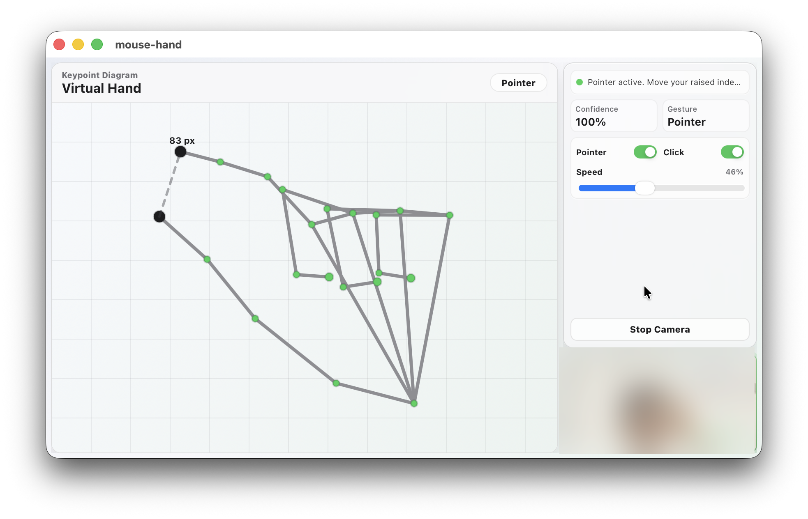

# Mouse Hand

Mouse Hand is a compact macOS-style desktop app that lets you control the system pointer with your hand. It uses the webcam, TensorFlow hand pose detection, and native Tauri commands to move, click, and drag with simple gestures.



## Features

- Real-time hand tracking with `@tensorflow-models/hand-pose-detection`.
- Virtual hand keypoint diagram for debugging the detected hand pose.
- Pointer movement with a closed fist and raised index finger.
- Pinch-to-click with index finger and thumb.
- Pinch-and-move drag and drop.
- Adjustable mouse speed.
- Native cursor actions through Tauri and Enigo.
- Compact utility-style UI designed for a small desktop window.

## Gestures

| Gesture                            | Action             |
| ---------------------------------- | ------------------ |
| Closed fist + index finger raised  | Move the pointer   |
| Index finger + thumb fully pinched | Mouse down / click |
| Keep pinching and move             | Drag               |
| Release pinch                      | Mouse up / drop    |

## Requirements

- Bun
- Rust
- Tauri desktop prerequisites for your OS
- Webcam access
- macOS Accessibility permission for native mouse control

## Development

Install dependencies:

```bash
bun install
```

Run the desktop app:

```bash
bun run tauri dev
```

Run frontend checks:

```bash
bun run check
```

Build the frontend:

```bash
bun run build
```

## Notes

The webcam feed is processed locally in the app. The screenshot above intentionally blurs the camera preview to avoid exposing personal visual data.
